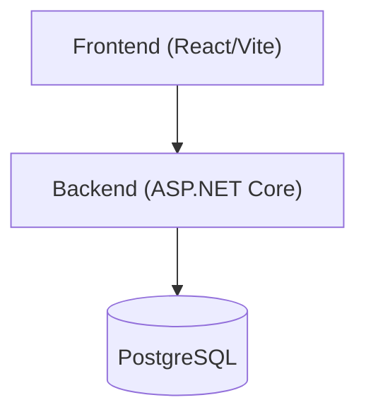

# OmniFit

A full-stack fitness tracking application for managing workouts and exercises.

## Tech Stack

| Layer | Technology |
|-------|-----------|
| Backend | ASP.NET Core 10, Entity Framework |
| Database | PostgreSQL 18 |
| Auth | ASP.NET Identity + JWT |
| Frontend | React 19, React Router, React Query, Tailwind CSS |
| E2E Tests | Playwright |
| Containerisation | Docker Compose |

## Architecture Diagram



## Getting Started

### Prerequisites

1. Docker Desktop

### Running Locally

1. Copy the `.env.example` file in the root folder:
   ```bash
   cp .env.example .env
   ```
   This file contains the environment variables used to create the PostgreSQL database

2. Copy the `.env.example` file in the `/frontend` folder:
   ```bash
   cd frontend
   cp .env.example .env
   ```
   This file contains a single environment variable for the url of the backend application. This should be `http://localhost:7223`.

3. Create an `appsettings.Development.json` file in the `/backend/src/OmniFit.Api` folder:
   ```json
   {
      "ConnectionStrings": {
         "DefaultConnection": "Host=localhost;Port=5432;Database=your_db_name;Username=your_username;Password=your_password"
      },
      "Jwt": {
         "Key": "your_jwt_key",
         "Issuer": "omnifit_api",
         "Audience": "omnifit_web"
      }
   }
   ```

4. Start the application using docker compose:
   ```bash
   docker-compose up
   ```

The backend will automatically apply database migrations on initial startup. The application will be available at `http://localhost:5173`.